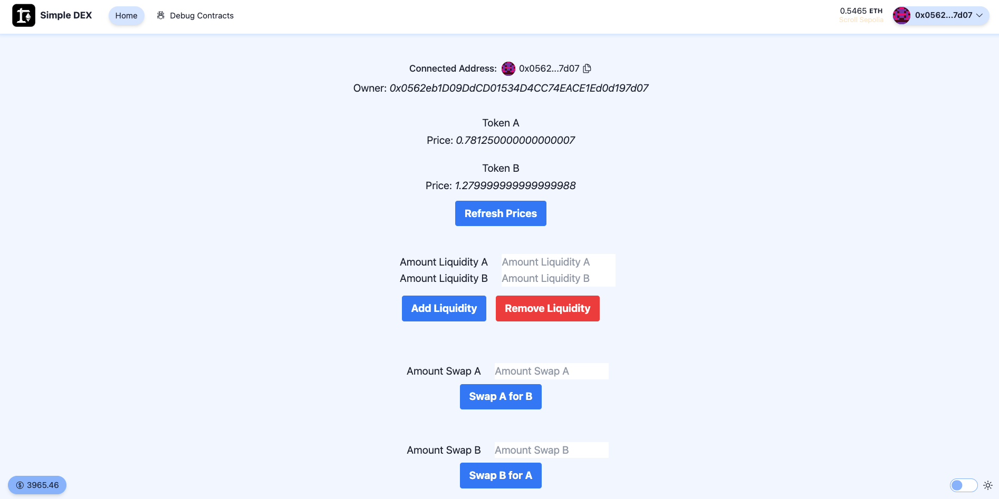

# Simple DEX UI

## Leandro Matayoshi: User interface for Simple DEX Eth-Kipu module 4

Este repositorio implementa una solución basada en NextJS (from Scaffold-ETH) para la UI del Exchange Descentralizado.

No despliega ningún nuevo contrato. En su lugar, interactúa con el contrato de Sepolia Scroll: DEXLeandroMatayoshi.sol subido para el módulo 4.

La UI de React se encuentra en el archivo: `packages/nextjs/app/page.tsx`. La ABI se encuentra en el archivo: `packages/nextjs/app/abi/SimpleDEX.json`

## Sepolia Scroll Scan Contrat Address 

https://sepolia.scrollscan.com/address/0x458A37Ef95BDA2950Ec4C879C7E714Ae7b2A2414

## Screenshot

## Video

[Watch the demo](https://drive.google.com/file/d/1_R7ttS05Yid4tAGooRYs7bFrO2YwjMS6/view?usp=sharing)

